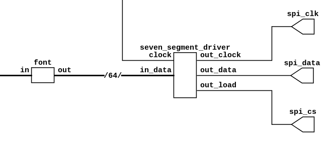

##############################
 MAX7219 SystemVerilog Driver
##############################

The driver Initialises the MAX7219 LED driver and continuously writes given data
to the LED registers.  Works for LED matrices and 7-segment displays.
A hexadecimal font is provided for the latter.

Testing
=======

Needs Verilator and Symbiyosys::

  make test

Demo
====

Needs

- yosys
- fpga-icestorm
- nextpnr-ice40
- iceFUNprog

Flash to FPGA with::

  cd demo/iceFUN
  make program

Afterwards, ports P8, P9 and P10 will output data, chip select and clock of the
LED controller.

TODO
====

- Provide examples for chained MAX7219 controllers.  The shift register already
  supports arbitrary width and should easily support multiple controllers.
- Extend assertions to gain more from Symbiyosys verification.

